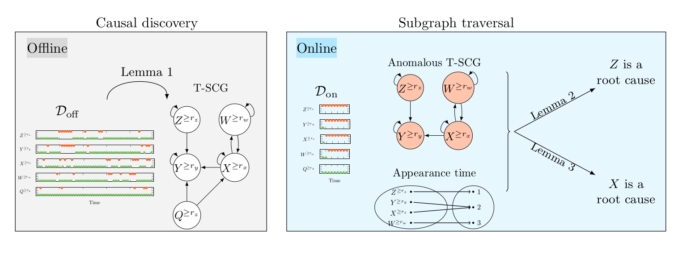

# Code Python T-RCA/T-RCA-agent



T-RCA is an algorithm designed to rapidly detect root causes of anomalies in threshold-based IT
systems. An extension of T-RCA, called T-RCA-agent, has been introduced to address scenarios where root causes are causally related by incorporating interventions from an agent. 
Both T-RCA and T-RCA-agent leverage causal discovery from offline data and engage in subgraph traversal when encountering new anomalies in online data.
For more details check our paper: Zan, L., Assaad, C.K., Devijver, E., & Gaussier, É. (2024). On the Fly Detection of Root Causes from Observed Data with Application to IT Systems (https://arxiv.org/pdf/2402.06500.pdf).
## Required python packages

Main packages: python=3.8, pandas, networkx, tigramite, joblib (needed by T-RCA and T-RCA-agent), 
sklearn, causal-learn, yaml (needed by other methods) 

### Install dependencies:
```bash
pip install -r requirements.txt
```

## Experiments
### Simulated data
1. To test algorithms on simulated data corresponds to _T-DSCM_ / _Change in causal coefficients_ / _Change in noise_ run:
```bash
     python Experiments/[setting]/Simu_[method].py
```
- [setting]: can choose from ['T-DSCM', 'Change_in_causal_coefficients', 'Change_in_noise'];
- [method]: can choose from ['AITIA_PM', 'CIRCA', 'CIRCA_star', 'CloudRanger',
'EasyRCA', 'EasyRCA_star', 'MicroCause', 'RCD', 'TRCA', 'TRCA_agent'];
- Results are saved in the folder 'Results/[setting]'.

2. To test robustness of T-RCA/T-RCA-agent within settings of _T-DSCM_ / _Change in causal coefficients_ / _Change in noise_ run:
```bash
    python Experiments/Robustness/[method]_[setting].py
```
- [setting]: can choose from ['TDSCM', 'change_in_causal_coefficients', 'change_in_noise'];
- [method]: can choose from ['TRCA', 'TRCA_agent'];
- Results are saved in the folder 'Results_robustness'.

### Real IT monitoring data
1. To test algorithms on _real IT monitoring data_ run:
```bash
    python Experiments/Real_IT_monitoring_data/Simu_[method].py
```
- [method]: can choose from ['AITIA_PM', 'CIRCA_star', 'RCD', 'TRCA', 'EasyRCA_CloudRanger_MicroCause_CIRCA'];
- Results are saved in the folder 'Results/IT_monitoring_data'.

2. To test robustness of T-RCA on _real IT monitoring data_ run:
```bash
    python Experiments/Robustness/TRCA_real_IT_monitoring_data.py
```
- Results are saved in the folder 'Results_robustness/IT_monitoring_data'.
